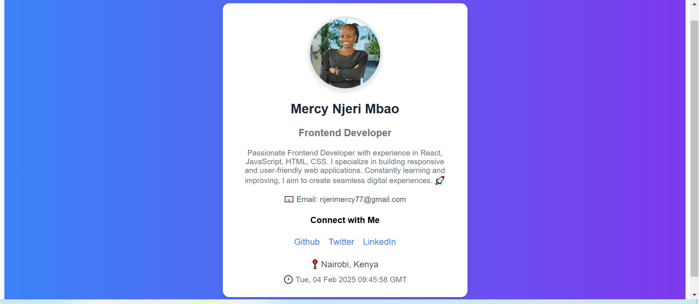

# Profile Card Project

This project is a profile card created with React vite and Vanilla CSS.

## Features
- Dynamic profile card with live time.
- Interactive social media links.
- Beautiful UI with Vanilla CSS styling.

## Screenshot


## Getting Started

To get a local copy up and running, follow these simple steps.

### Prerequisites

- Install `Node.js` and `Yarn`.

### Installing

1. Clone the repo:
   ```bash
   git clone https://github.com/mercie-ux/profile-card.git
